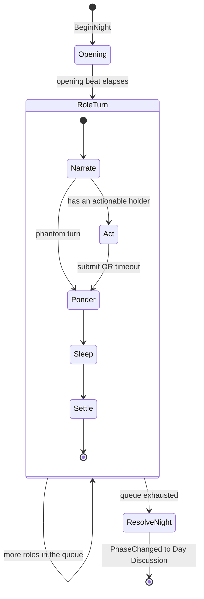
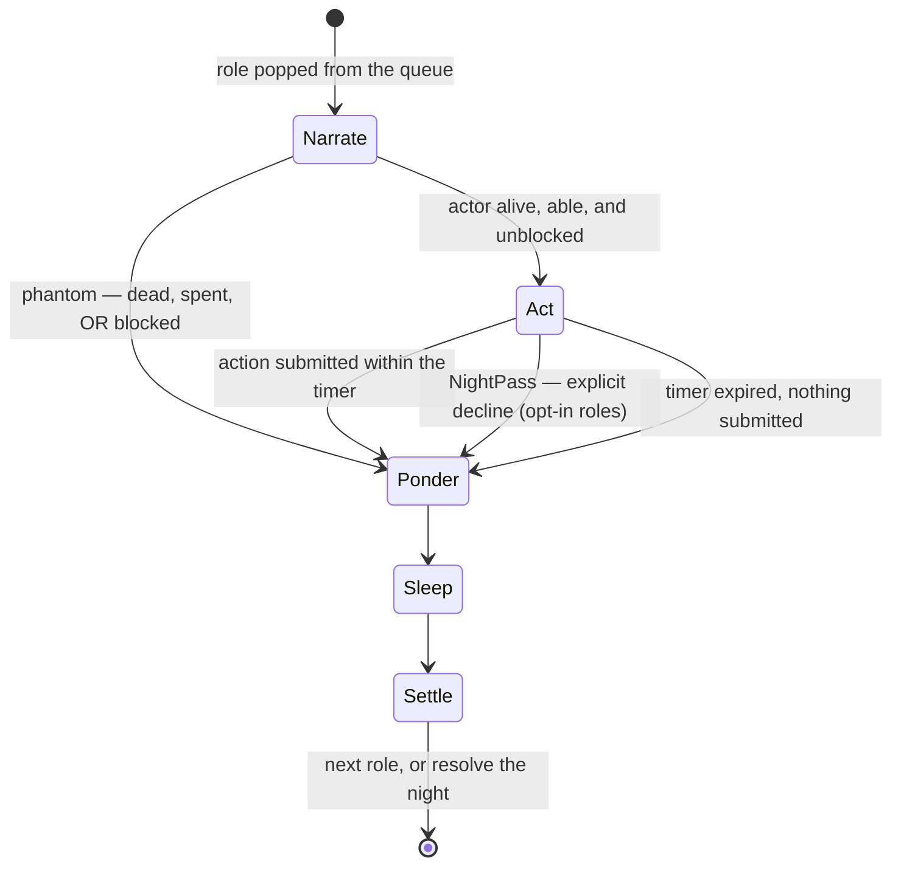
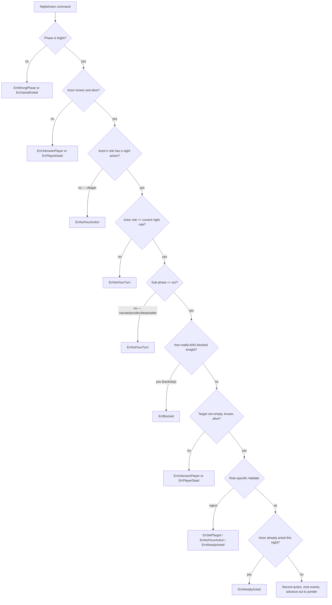
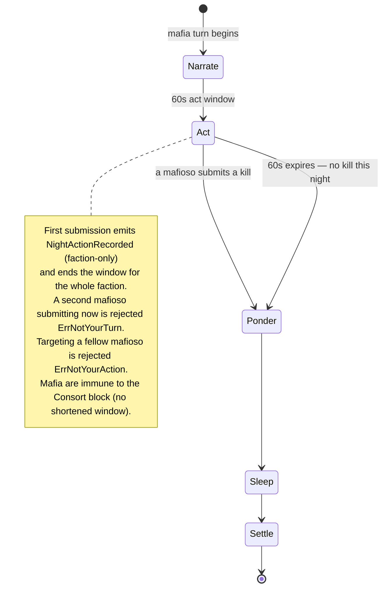
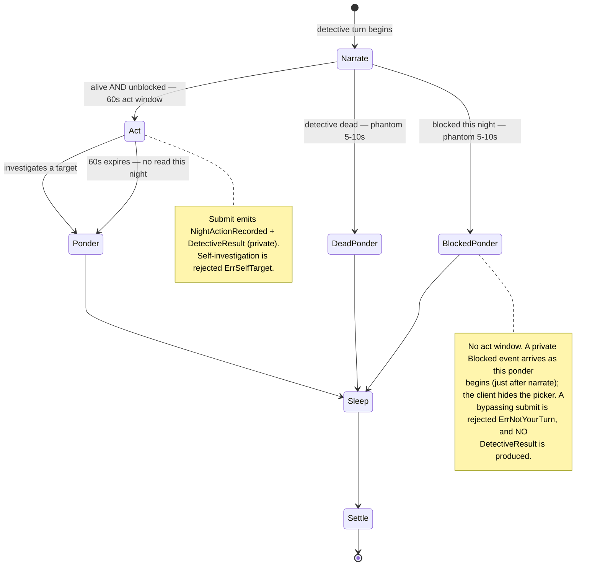
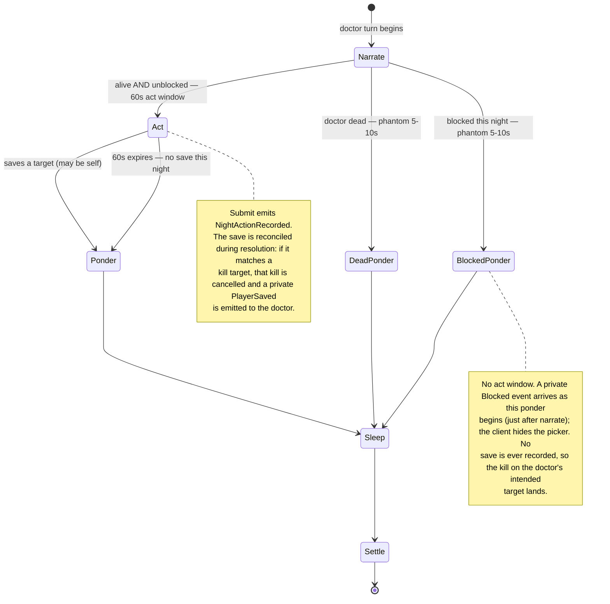
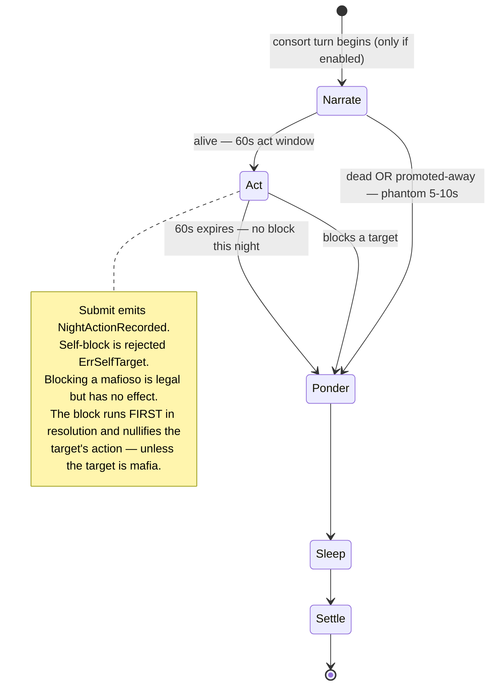
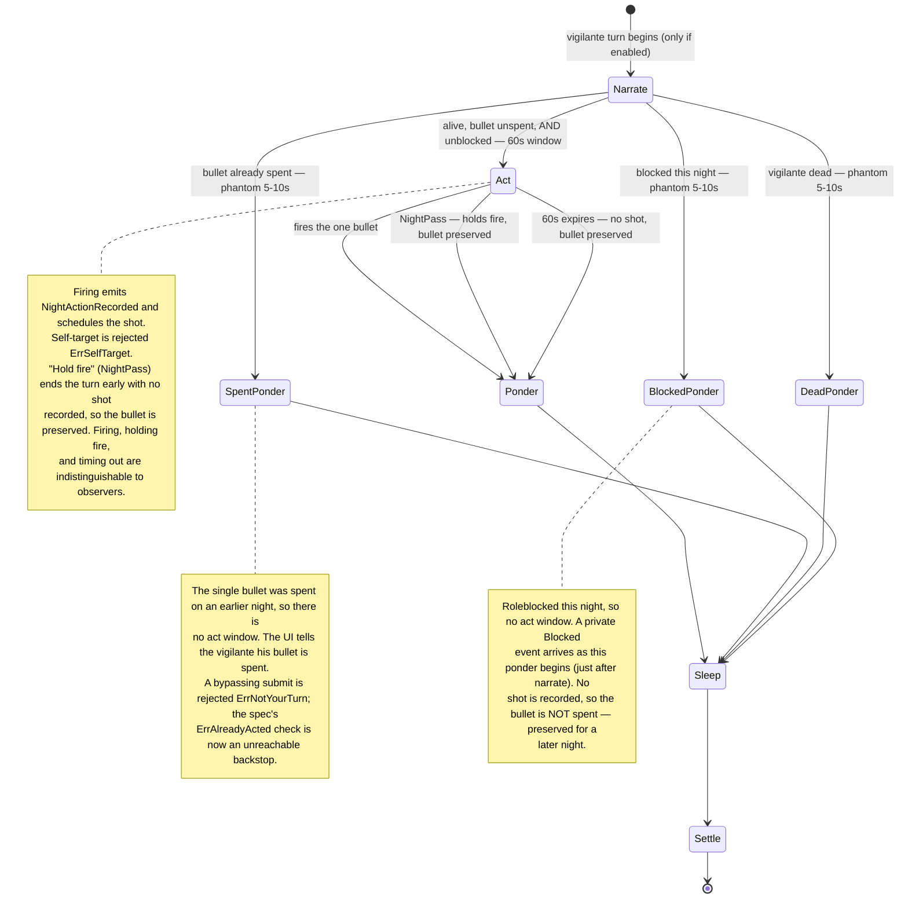
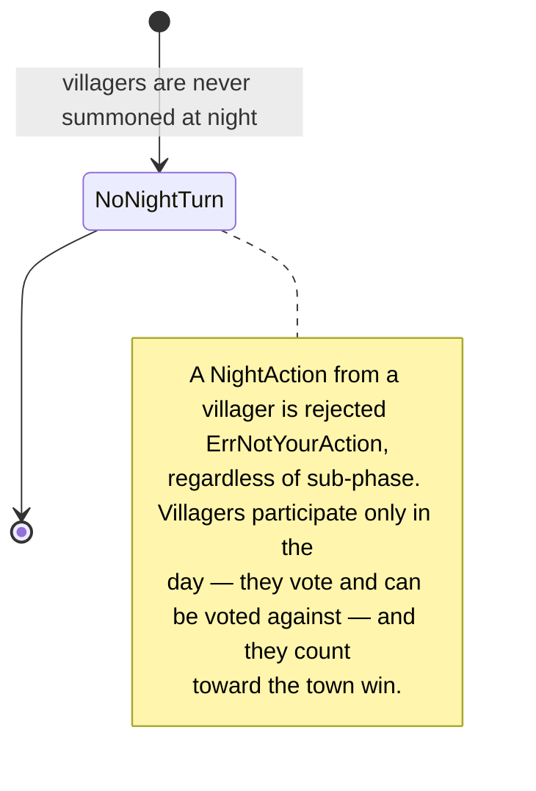

# Role State Transition Diagrams

This document describes how each role moves through a night turn, including
every branch the engine can take: an action submitted within the timer, an
action **not** submitted (timeout), an action **blocked** by the Consort, a
one-shot ability that is already **spent**, a **dead** role, and the validation
rejections that can occur.

A unifying idea runs through all of this: **any turn whose holder cannot take an
effective action is a _phantom_ turn** — it narrates and then goes straight to a
ponder, skipping the act window entirely. "Cannot act" covers three cases that
the engine treats identically: the role has **no living holder** (dead), a
one-shot ability is **spent** (an out-of-bullets Vigilante), or the holder was
**roleblocked** by the Consort this night. Because the phantom ponder is a
single randomized 5–10s beat, an observer can't tell *which* of those reasons
applies — so a block is no longer a timing tell. See `roleTurnIsPhantom` in
[`state.go`](../internal/game/state.go).

The engine itself is **timeless** — it only knows sub-phase *order*. All
wall-clock durations are owned by the room layer
([`internal/room/config.go`](../internal/room/config.go)); the values quoted
here come from the `Default*` constants there. The night state machine lives
in [`internal/game/rules_phase.go`](../internal/game/rules_phase.go) and
[`internal/game/rules_night.go`](../internal/game/rules_night.go); per-role
behaviour lives in [`internal/game/rolespec.go`](../internal/game/rolespec.go).

> Diagrams use [Mermaid](https://mermaid.js.org/), which renders inline on
> GitHub.

## Contents

- [The night, end to end](#the-night-end-to-end)
- [The per-role turn skeleton](#the-per-role-turn-skeleton)
- [Sub-phase durations](#sub-phase-durations)
- [The NightAction validation gate](#the-nightaction-validation-gate)
- [Mafia](#mafia)
- [Detective](#detective)
- [Doctor](#doctor)
- [Consort (optional)](#consort-optional)
- [Vigilante (optional)](#vigilante-optional)
- [Villager](#villager)
- [Night resolution order](#night-resolution-order)

---

## The night, end to end

A night is a fixed **opening** beat followed by one turn per role in the wake
queue, then resolution. The wake order is:

```
Mafia  →  [Consort]  →  Detective  →  Doctor  →  [Vigilante]
```

`[Consort]` and `[Vigilante]` are **optional** roles (host toggles before the
game starts); when enabled they each take a villager slot. The queue is built
from the *dealt-time* toggles, not the live roster, so a dead (or spent, or
promoted) role's turn still runs — as a **phantom** — to keep the moderator's
audio cadence and to avoid leaking who is still alive.



---

## The per-role turn skeleton

Every role walks the same five-step skeleton. The only decisions are:

1. **narrate → act vs narrate → ponder** — `act` opens only when the turn has
   an *actionable* holder. A turn is **phantom** (skips `act`, goes straight to
   `ponder`) when the role has no living holder, its one-shot action is spent
   (an out-of-bullets Vigilante), **or** its holder was roleblocked this night.
   See `roleTurnIsPhantom` in [`state.go`](../internal/game/state.go).
2. **act → ponder** — driven by the actor's submission (`NightAction`), an
   explicit decline-to-act (`NightPass`, opt-in per role — today only the
   Vigilante's "hold fire"), or the act-window timer expiring (`AdvancePhase`).
   All three are deliberately indistinguishable downstream: same cadence, so
   observers can't tell a submit from a pass from a timeout.



A blocked holder learns of the block via a private `Blocked` event delivered
**when the cannot-act ponder begins** — i.e. just *after* their narrate cue,
mirroring the old "told at the start of your beat" timing. The client shows the
notice and keeps the picker hidden.

---

## Sub-phase durations

Source of truth: `internal/room/config.go`. The engine emits `Deadline = 0`;
the room stamps the real wall-clock deadline before broadcasting, so server and
clients agree.

| Sub-phase | Duration | Notes |
| --- | --- | --- |
| `opening` | 7s | Once per night, before any role. |
| `narrate` | 2.5s | Universal "wake up" cue. |
| `narrate` (Mafia, Day 0) | 4s | Extra "recognize each other" beat. |
| `narrate` (Mafia, Day 1+) | 1.5s | Shorter per-night line. |
| `act` | 60s | Normal action window. Only a turn with an actionable holder reaches it. |
| `ponder` (real, most roles) | 2s | Post-submit breath. |
| `ponder` (real, detective) | 3s | Sized to read the result modal. |
| `ponder` (phantom) | 5–10s (random) | Hides *why* the turn was inert (dead/spent/blocked). |
| `sleep` | 1.5s | "Go to sleep" cue. |
| `settle` | 3s | Post-sleep beat before the next role. |

There is **no shortened "blocked" act window** — a blocked actor never reaches
`act` at all; their turn is phantom. The phantom ponder is **randomized**
specifically so an observer can't deduce from timing why the turn produced no
action: a dead, spent, and blocked role are all indistinguishable.

---

## The NightAction validation gate

Before any role-specific logic runs, every `NightAction` passes a generic gate
in `applyNightAction` ([`rules_night.go`](../internal/game/rules_night.go)).
This is where most rejection branches live.



> The **blocked** branch (H → `ErrBlocked`) is now a defense-in-depth backstop.
> A blocked actor's turn is phantom, so it never enters `act`; the sub-phase
> gate (G) already rejects any bypassing submit with `ErrNotYourTurn` before
> control reaches H. The branch survives only in case the phantom routing is
> ever bypassed.

The per-role `Validate` hook (step J) is:

- **Mafia** — target may not be another mafioso (`ErrNotYourAction`).
- **Consort / Detective / Vigilante** — may not target self (`ErrSelfTarget`).
- **Vigilante** — bullet already spent (`ErrAlreadyActed`, a backstop; see below).
- **Doctor** — none (self-save is allowed).

### NightPass — explicit decline-to-act

A separate command, **`NightPass`**, lets a holder end their act window
*early* without acting — the engine side of the Vigilante's "hold fire" button.
It's opt-in per role via the spec's `AllowPass` flag (today only the Vigilante),
and passes a much shorter gate in `applyNightPass`: PhaseNight, a living actor
whose role has `AllowPass` set (else `ErrNotYourAction`), that role is the
current night role, and the sub-phase is `act` (else `ErrNotYourTurn`). It
records **nothing** — no `pendingNight` entry, so no resource is spent — and
simply advances `act → ponder`, identical to a timeout. Mafia are deliberately
excluded: their turn is faction-collective, so one mafioso must not be able to
end the kill window for everyone.

---

## Mafia

- **Faction:** Mafia. **Always first** in the queue and **never phantom** — the
  game ends the instant living mafia hits zero, so a night never begins without
  a living mafioso.
- **Immune to the Consort block.**
- **Faction-collective:** any living mafioso may submit during the act window;
  the **first** submission locks the kill target and closes the window for the
  whole faction.



**On resolution:** the mafia kill resolves **first**. A doctor save on the same
target cancels it (`PlayerSaved`, private to the doctor); otherwise the target
dies (`PlayerKilled`, public).

---

## Detective

- **Faction:** Town. Always-on reserved role.
- **Blockable** by the Consort.
- Result is delivered **immediately and privately** at submit time (it does not
  wait for resolution).



> An un-promoted Consort reads as **not mafia** (she is `FactionConsort`); only
> after she is promoted to `RoleMafia` does she read as mafia.

---

## Doctor

- **Faction:** Town. Always-on reserved role.
- **Blockable** by the Consort.
- **Self-save is allowed** on any night.



---

## Consort (optional)

- **Faction:** `FactionConsort` — mafia-aligned for *winning*, but her own
  knowledge group (she neither sees nor appears in mafia coordination).
- Wakes **right after the mafia** (only if enabled).
- **Never blocked herself** (she is the only blocker, and she acts before the
  town roles).
- Promotion: if the entire mafia cabal is wiped while she lives, she is promoted
  to `RoleMafia` (private `ConsortPromoted` + `MafiaRosterRevealed`).



> When a promoted Consort no longer holds `RoleConsort`, her old turn keeps
> running as a phantom so the cadence doesn't shorten and leak the takeover.

---

## Vigilante (optional)

- **Faction:** Town. Wakes **last** (only if enabled).
- **One bullet for the whole game.**
- **Blockable** by the Consort — and a block nullifies the shot **without
  spending the bullet**.
- May **hold fire**: an explicit `NightPass` (the client's "Hold fire" button)
  ends the act window early without firing, keeping the bullet for a later
  night and sparing the table the full 60s wait.
- Once the bullet is spent, the Vigilante's turn becomes a **phantom** (no act
  window), indistinguishable from a dead role.



**On resolution (order matters):**

1. The mafia kill resolves first. If the mafia targeted the Vigilante and he
   wasn't saved, **he dies and his shot never lands** (mafia precedence).
2. The Vigilante's shot resolves second, **only if he is still alive**. A doctor
   save on the Vigilante's target cancels the shot (`PlayerSaved`) — but the
   **bullet is still spent**.

The one-shot flag (`vigilanteShotUsed`) is set during resolution **only if a
shot was actually recorded**, so a *blocked* Vigilante keeps his bullet.

---

## Villager

- **Faction:** Town. **No night action** and **never in the night queue.**



---

## Night resolution order

After the last role's `settle`, `resolveNight` reconciles every scheduled intent
into actual deaths/saves and the public events. Phases run in a fixed order so
roles that depend on each other see consistent state.

```mermaid
stateDiagram-v2
    [*] --> Block : nightPhaseBlock
    Block --> Schedule : Consort block recorded; blocked non-mafia actions are skipped
    Schedule --> Resolve : mafia kill, doctor save, vigilante shot recorded as intents

    state Resolve {
        [*] --> MafiaKill
        MafiaKill --> VigilanteShot : mafia target dies unless the doctor saved it
        VigilanteShot --> [*] : resolves only if the shooter is still alive; a save wastes the shot
    }

    Resolve --> Reveal : nightPhaseReveal
    Reveal --> SpendBullet : detective reads the resolved state
    SpendBullet --> [*] : vigilanteShotUsed set if a shot was recorded
```

**Events emitted during the night (by visibility):**

| Event | Visibility | When |
| --- | --- | --- |
| `NightSubPhaseStarted` | public | every sub-phase boundary (carries `Phantom`) |
| `NightActionRecorded` | faction-only **for the mafia**; **private to the actor** for solo roles (detective / doctor / vigilante / consort) | an actor submits within the act window |
| `DetectiveResult` | private (detective) | at the detective's submit time |
| `Blocked` | private (blocked actor) | as the blocked actor's cannot-act ponder begins (just after their narrate) |
| `PlayerKilled` | public | a kill lands during resolution |
| `PlayerSaved` | private (doctor) | a doctor save cancels a kill |
| `PhaseChanged` | public | night resolves into Day Discussion |

> `NightActionRecorded` is scoped to `FactionMafia` only for the mafia (co-mafia
> must see the locked kill to coordinate). Solo town/consort roles share a
> faction with non-actors, so scoping their ack to the faction would leak the
> hidden role — they get a private self-ack instead.
>
> **`ConsortPromoted` / `MafiaRosterRevealed`** are *not* night events: the cabal
> can only be wiped by a **lynch** (mafia are unkillable at night), so they're
> emitted privately to the consort during day-vote finalization
> (`applyFinalizeVotes` → `promoteConsortIfNeeded`), not during night resolution.
